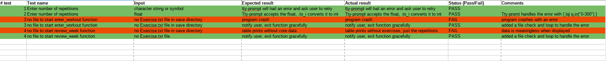
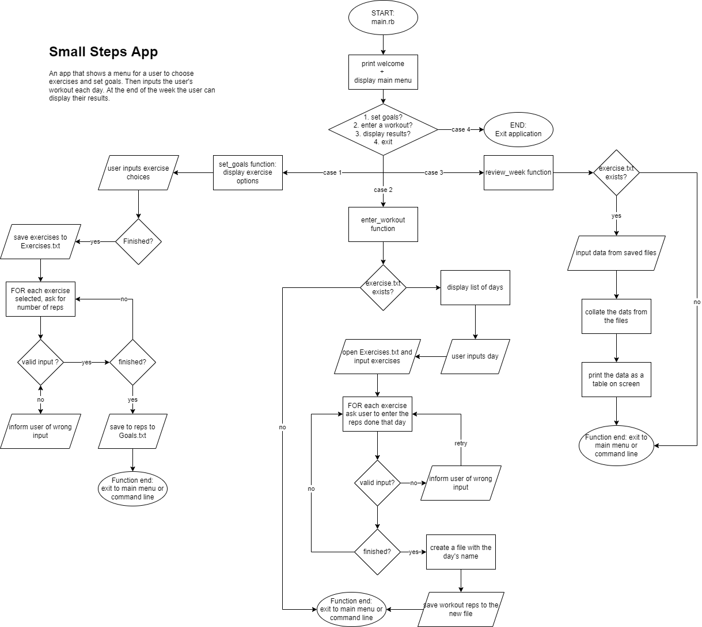
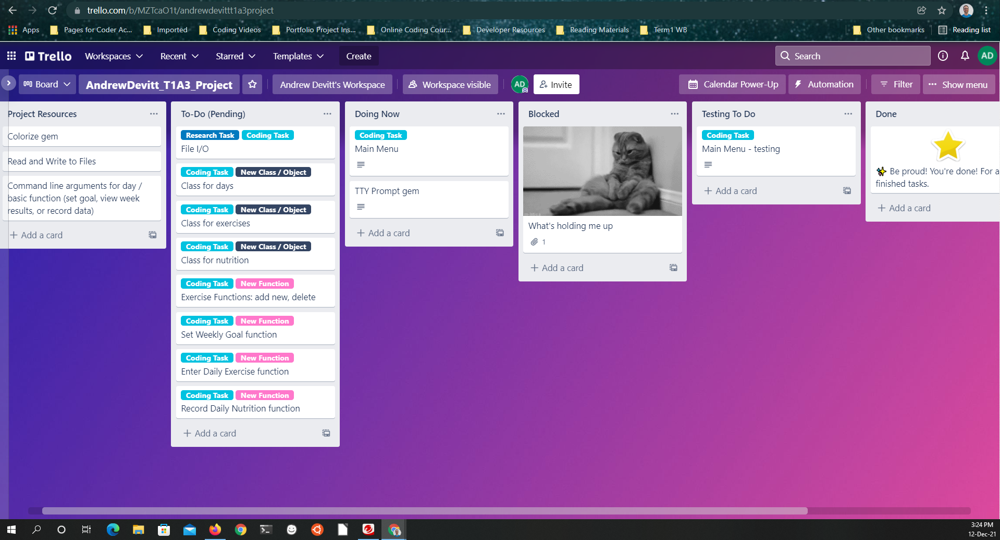
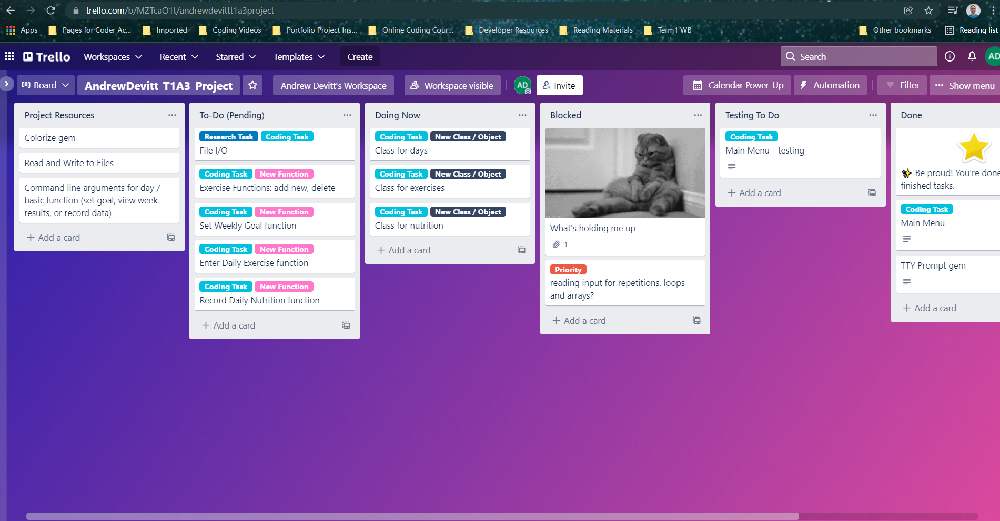
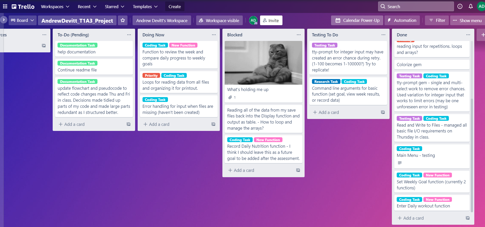
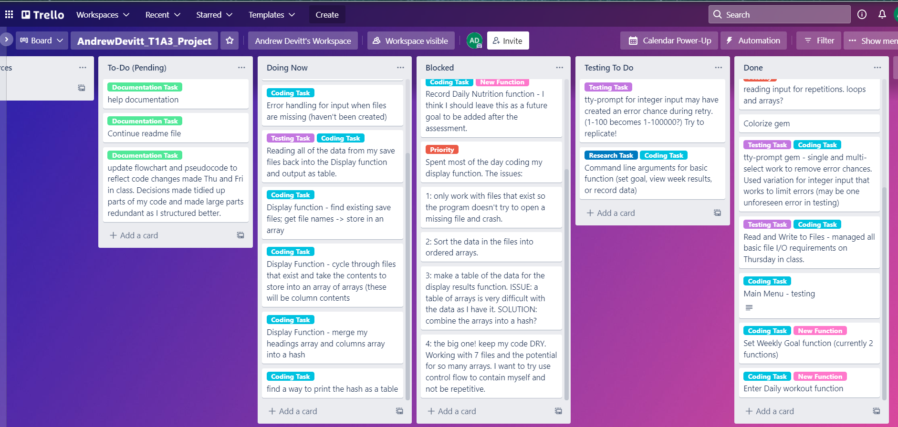
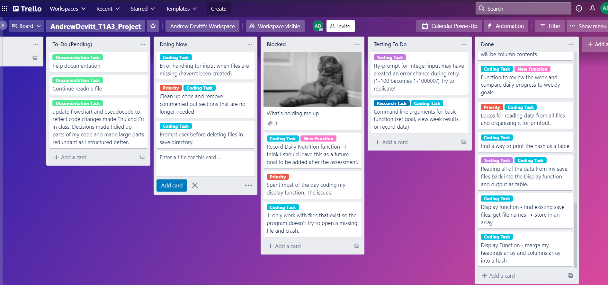
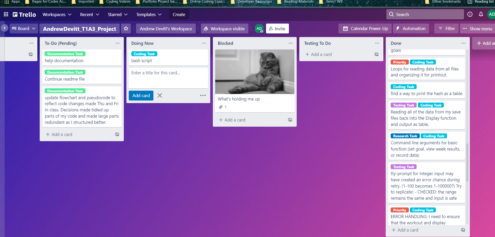
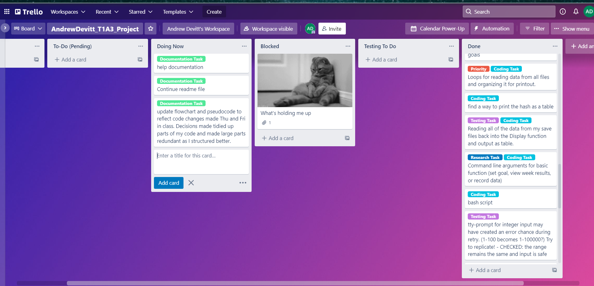

# AndrewDevitt_T1A3
Andrew Devitt - Terminal Application

# README Document

## Source Control Repository Link
https://github.com/AnderDevitt/AndrewDevitt_T1A3
# Software Development Plan

# Application Overview
**Small Steps** is an application for people who want to make improvements to their fitness, but may have difficulty motivating themselves to follow a fitness plan and track their progress. This application will allow them to set a weekly goal for fitness, and track their actual effort towards that goal. 

Users may set their weekly goals as high or low as they feel on a new week. The goal of the program is motivation to make some daily effort towards healthy exercise habits. 
# Statement of Purpose
## The problem
The problem which the application hopes to solve is that many people want to get healthier but struggle to motivate themselves to do regular exercise. Small Steps will help them by encouraging them to set small goals for each week that they will not mind trying. In a busy week, they might choose to set goals they can quickly achieve each day. When they feel they have more time or energy in a week, the goals may be bigger. 
## Target audience
The Small Steps application is intended for use by people who know how to do some exercises, but have low levels of motivation to begin and maintain exercise programs. The people using this application should be competent with basic forms of body-weight exercise (the application will not give instruction).
## How users will use the app
To use this application, a user would first open the app and choose the **Set my goals** option from the menu. They will then select the exercises they want to do this week, and for each exercise they will be prompted to enter the number of repetitions for their goals. Users should not attempt unrealistic goals. For example, if I know that I can do 12 pushups, I should aim for 15-20 before trying a higher amount. The goal of the app is that you can achieve "Small Steps" towards better fitness. The data input is saved to file as it is expected that the user would exit the app after setting their goals.

For each day that the user completes a workout with the exercises they have selected, they will start the app and choose **Enter today's workout**. Here they will select the day, and then be asked to enter the number of reps for each exercise done. Again, it is expected that they will exit the application after completing this input, and the app saves the data for future sessions.

After the week's final workout (or at any time prior), the user may select the option **Review the week** to see the results of their week's efforts displayed to screen as a table.

# List of application features
## Main program file
The Main file handles the Ruby Gems and file libraries for the application. It initializes two variables (prompt and font) for the gems *tty-prompt* and *tty-font*. These variables are passed into functions as needed for program operation. (During coding I maintained them as global variables to simplify the process.)

The main file uses an if-conditional to first check whether the user has input any of three command line arguments (goals, workout, results). If an argument is input, the program will call the relevant function, execute that function alone, and then exit the application. This is convenient when the user only wishes to run one particular function quickly.

If there are no arguments, the program will display the welcome greeting and call the main_menu function which prints three options. It will pass the prompt variable to the function for use.

After the user choose a function from the main menu, the choice is returned into the variable "option" and a case statement is run. The function of the case statement is to call the appropriate function, or exit the application if the option "Exit" was returned. 

The select_exercises and review_week functions both require that the Exercise.txt save file exists. The goal.txt file should also exist, but only the Exercise.txt file can cause an application crash. If the file does not exist, the user will be notifies, informed what needs to be done, and returned to the main menu to fix the problem.
## Main menu function
The main menu receives and returns the value of the variable "prompt" which is used by the tty-prompt gem. This gem displays a menu with four options (the three program main functions and exit). Errors are handled by the tty-prompt gem.
## Select exercises function
The variables prompt and font are passed to the function for use by the gems tty-prompt and tty-font. The function first asks the user whether to delete past data files via a tty-prompt that returns a boolean value. If yes is selected, an if-statement will call the fileutils gem to remove all files from the save directory. This is needed to reset data and handle the error of false (old) data being added to a week's results. The option exists in case a user wishes to edit their goals data without deleting workout data for days they have entered for a week (e.g. if they want to edit number of reps but keep the same exercises).

The function will use tty-prompt multi-select to allow the user to choose their exercises and then save the selections to the Exercise.txt file (and an array used to complete this function instance). Next, tty-prompt is reads the exercises from the array and asks the user to enter the number of reps for each. Error handling in the prompt ensures a number within the range of 0 to 300 is entered. The number is also converted to integer and then the values are saved to the file Goal.txt
## Enter workout function
This feature allows the user to select a day and enter their workout for that day. They do not have to enter data for all days for the program to work, nor for the results to be displayed at the end of the week.

The first task of the function is to handle a file read error in the case of a missing Exercise.txt file. If the file is missing, this function and the review_week function would return an error and crash the app. A conditional loop (if) is used to check if the file exists in the save directory. If it does, the function runs. If not, it will notify the user that the file cannot be found, inform them that they need to set their exercises and goals for the week, and exit the function. It will exit to command line if the user called the function with a command line argument, or to main menu if they came from there.

The function uses tty-prompt to get the name of the day, then opens the Exercise.txt file and pushes the exercise names into an array.

Using a loop with the method *.each*, the function reads each exercise from the array, enters the name of the exercise into a tty-prompt and asks the user how many reps they did that day. This tty-prompt handles possible input errors in the same way as for entering the goals in the select_exercises function, by limiting the range of inputs to a number between 0 and 300. The results are pushed to an array.

Finally, the results in the array (numbers of reps) are saved to a text file with the name of the day. (Existing files are always overwritten)

## Review week function
This function reads the data from all save files and collates it into a table for display. 

The Exercises.txt file is required, and the same conditional statement and file check is used to handle the error that would arise if the file were missing.

The first task of the function is to read the names of all existing files in the save directory into an array. This is necessary as not all files may exist (if a user didn't do exercises on a given day) or in case the user were to accidentally save unrelated files in the directory. 

Next, the names of existing files are compared against an ordered list of (possible) expected files, and sorted in their array to match that order. A second array for headings is created with the file extension (.txt) removed.

A loop is used to read the data from the existing files (in order) and put it into arrays, which are then stored inside an array caller read_array. The contents of each array within read_array are then transposed so that all of the elements that will fill table columns are moved into the same arrays (e.g. all of the repetitions for Monday are in the same array, in exercise order.) 

Next hashes are made combining the headings array with the colums data (withing the transposed arrays) and these hashes are pushed to an array (arr). Finally, each column is printed into a table format. 

Two key parts of this function are (while modified by me a little) primarily sourced from online pages. The source pages for the code used to create combined hashes and print the table are:
- [combined hashes](https://medium.com/@alinaarakelyan/ruby-combing-two-arrays-into-a-hash-3d4f1c6bcf67)
- [print a table from arrays](https://stackoverflow.com/questions/28684598/print-an-array-into-a-table-in-ruby)

# User Experience
## User interaction
The user can interact with the application in one of two ways. Firsly by running the application without command line arguments. In this case, they will see a welcome screen, main menu and explanations for menu options and how to select them. 

In the case that the user wants to quickly execute a single function without visiting the menu, they can start the program with the apprpriate argument (goals, workout, results). This is convenient for users familiar with the app's features who wish to save time. 

Within each feature, advice about the purpose and instructions is given, which should allow a user to easily use the features as intended.

Clear instructions are given in the Help section of this document. 

## Errors
Due to the use of tty-prompt for most user interaction, most errors are handled within tty-prompt. However, there are two types of error that have been identified, tested, and which are anticipated to occur. 

The first is when the user is prompted to enter a number of repetitions. The error is handled by including { |q| q.in("0-300") } in the prompt. This ensures that the user can only enter a number within the range of 0 to 300. Until the user enters a number within range, they will be prompted >> Value we must be within the range 0..300.

The other error fatal to the app is when the enter_workout or review_week functions are run without the Exercise.txt file in the saves directory. Tests showed this would crash the program in the both functions as the file data is needed for the core elements of each to work. In enter_workout, the file is needed to name each exercise in the prompt for the user to enter repetitions and to ensure repetitions data are stored in the correct order and number for execises. In the review_week feature, the file is required because (while the function will not crash without it) the data is useless without it.

Manual testing was used for these tests as most opportunities for errors are taken care of by the use of tty-prompts, and automatic tests of my identified errors are not possible as far as I can determine.  

# Control flow diagram

# Implementation plan
My implementation plan was tracked with a Trello board.

- Project Trello: https://trello.com/b/MZTcaO1t/andrewdevittt1a3project

- Link for board member invite: https://trello.com/invite/b/MZTcaO1t/cdb9ee46c13808c02c0569d87aa2062f/andrewdevittt1a3project

## Beginning the project
Here I had planned what I thought I would need to include and use to make my program

## Class VS Array issues
The first days of the project I struggled with how to handle data. I experimented with classes and using rspec, but my results were looking too much like the work Jairo showed us in class during lessons and I didn't want my app to be so close to his examples. I was also having success with arrays and loops for my data handling, but producing too many arrays. My code was not DRY. 

## A day of success
After speaking with my instructor, I settled on arrays instead of classes and assigned Nutrition as a future feature outside the scope of this project. Most of the core features were programed, and I learnt the file I/O I would need over two days. A lot of research was required. I identified errors for testing here and began manual testing.  

## The biggest challenge
The feature to display results was the most difficult part of the process. As I elected to use arrays and files to store my data, I had to find a way to read from save files that exist, put the data back into arrays and organise it. I had to account for the fact that a user might not enter data for every day. I experimented with several ways of drawing tables, but only one seemed appropriate to my data structures (the others giving only partially successful results). That table required an array of hashes. It took two days to find/create solutions to my data issues to create the hashes and arrays for this function.    

## Clean up and file error handling
Cleaning up my code to make it DRY. Solving the problem of my app trying to open a non-existent file, and adding a means to delete old save files. Added command line arguments for quick access to each main feature.

## Doccumentation updates and final touches
The Readme and Help doccumentation needed to be edited and finished.
There is an issue with my repository files where I cannot run the on another PC after downloading them. Permissions errors. We haven't been taught what to do with this on the course though, and I cannot find an online solution that works.

# Help file
## Installation
To install this app, download the zip file AndrewDevitt_T1A3 from **GitHub** at the link:
https://github.com/AnderDevitt/AndrewDevitt_T1A3

Please ensure that you have Ruby installed on your system. 

Extract the file and go to the /src directory. Then run the run_app.sh bash file. 

### Bash file command to run the app and install necessary dependencies:
-**type**: *./run_app.sh*

The bash script will install the ruby gem dependecies for you, and then run the app.
## How to use this application
Thank you for choosing Small Steps. This application will hel you to set small exercise goals and enter your workouts for the week. It has three features for you to use. Set my goals, Enter today's workout, and Review the week.

### Set my goals
Note: Before you begin, the program will ask you if you want to delete the saved data files. For normal operation, if you are beginning a new week, please choose "y" (yes) here. You may choose not to delete the files if you have already recorded data for a workout but wish to update the number of repetitions for an exercise without deleting that workut day. Note that you should normally choose "yes".

You must run this feature first. The feature will allow you to choose exercises from a list and set the target number of repetitions you want to do for each exercise. You may choose as many or as few exercises as you wish to do - although we recommend trying three as a start. The exercises you choose will be saved and these are the ones for your workout each day.

Next, you will be asked to set the number of repetitions you want to be able to do for each exercise. Please enter a number between 0 and 300. For example, if you aim to do 30 pushups a day, type: 30. The app will save this data to a file and return you to the main menu (or exit the app if you used a command line argument). You can exit the app and your data will be saved. 

### Enter today's workout
Use this feature to track your progres each day after your workout. You will first be asked what day it is. After you choose the day, for each of your exercises the app will ask you to enter the number of repetitions you did that day. Enter a number between 0 and 300. After the data for the last exercise is entered, you will be returned to the main menu (or exit  the app if you used a command line argument). You can exit the app and your data will be saved to file. 

Note: this feature will not run if you have not set your goals for the week.

### Review the week
Run this feature to see the results of your workouts for the week. A table will display your exercises and the goals you set for each. For each day you worked out, the repetitions you did will be displayed in the table. Days that you don't exercise on will not be displayed.

Note: This feature also requires that you have set your goals at the beginning of the week in order to run it.

## Quick use of application with command line arguments
Each main feature of the application can be accessed from the command line and run without entering the main menu system. Once you are familiar with the application, this is likely to be your preferred way to use it as it will save you time. Once you have completed using the function, the app will close, returning you directly to the command line.
The argument keywords are: *goals, workout, results*.
### Use these commands in terminal to jump straight to functions:
- **Set goals function**: *./run_app goals*
- **Enter Today's workout**: *./run_app workout*
- **Review the week**: *./run_app results*

## Dependencies
If you need to manually install the dependencies for this app, use gem install and the name of the gems below.

- **"tty-prompt"**
This gem is used for the menus and user input prompts throughout the app.
- **"colorize"**
This gem colors the text in the app.
- **"tty-font"**
Used to display the app name.
- **'fileutils'**
Used for file input and output operations.
